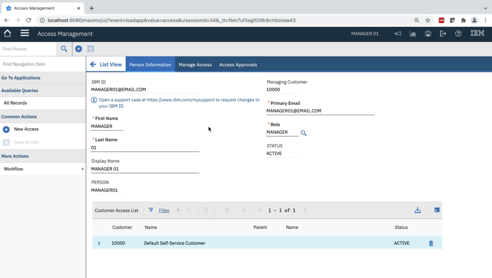
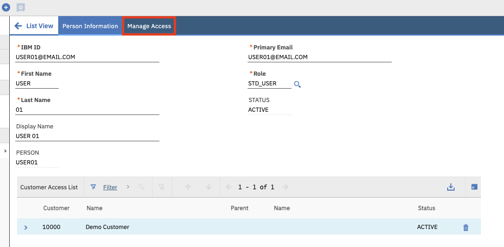
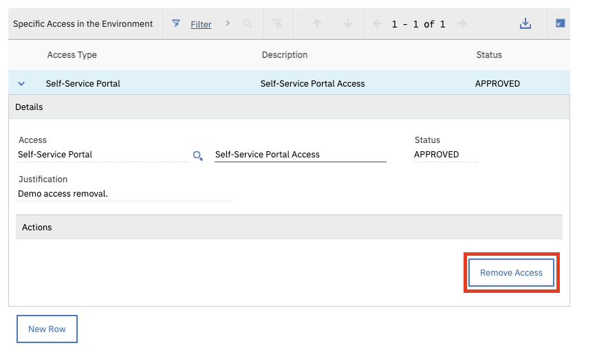
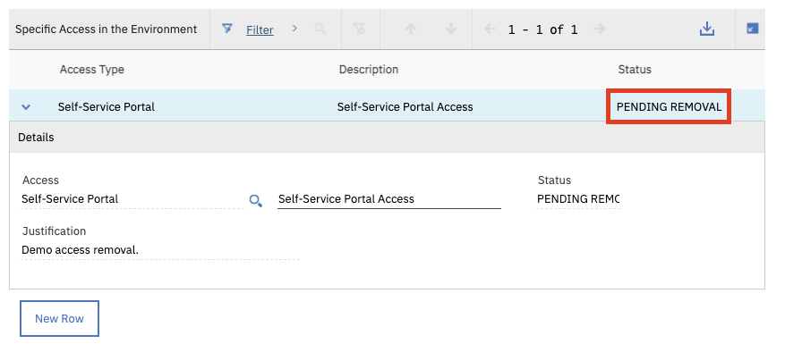
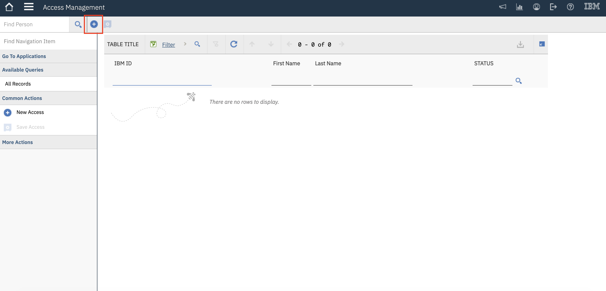
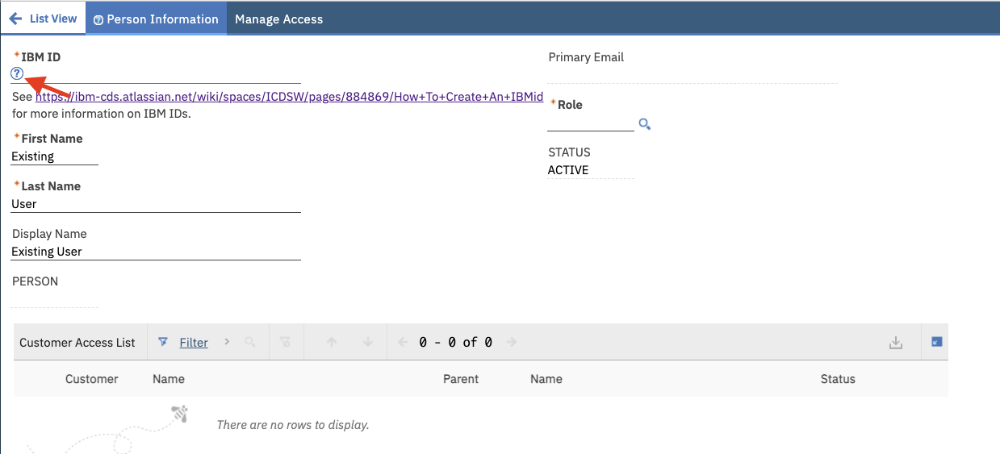
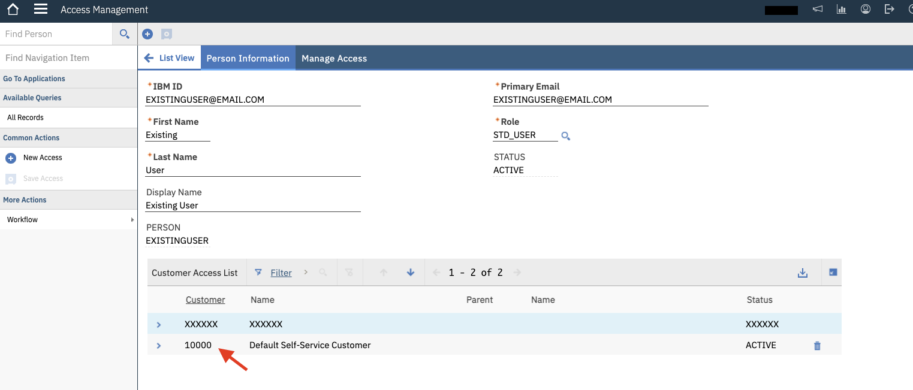
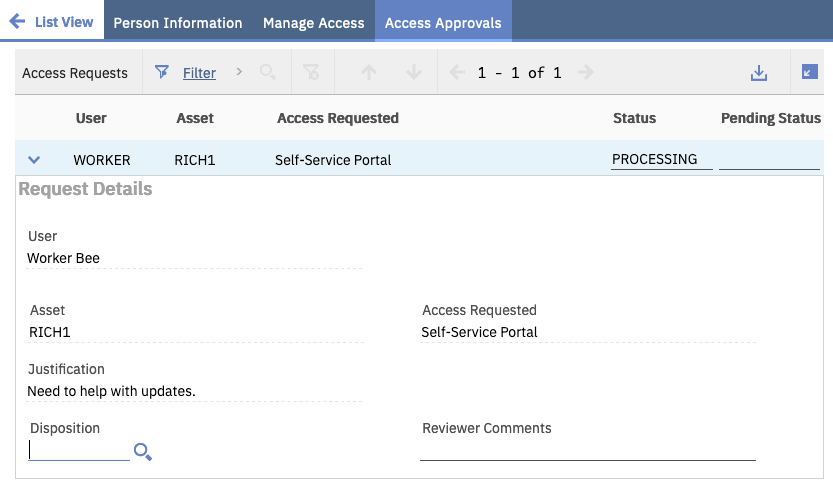
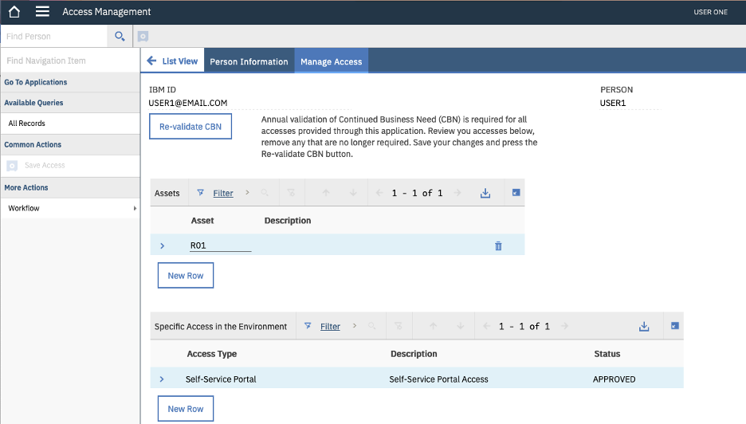
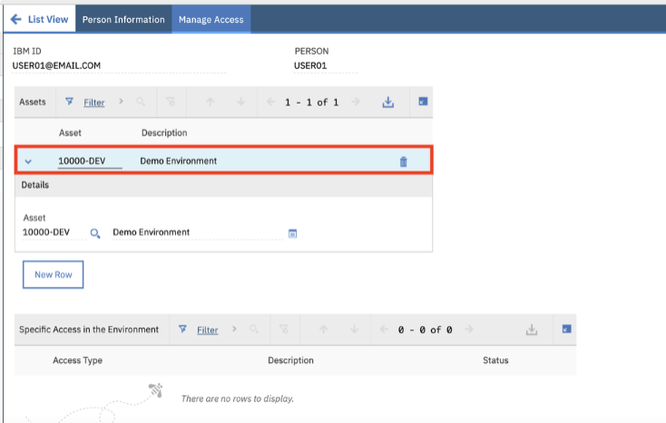

---

copyright:
  years: 2015, 2020
lastupdated: "2020-11-12"

subcollection: mas-ms

---

{:shortdesc: .shortdesc}
{:screen: .screen}  
{:codeblock: .codeblock}  
{:pre: .pre}
{:tip: .tip}
{:note: .note}
{:external: target="_blank" .external}

# Self-Service Portal
{: #ssp}

## Access Management Tool
{: #access-management-tool}

The Access Management Tool is a self-service tool, located in the IBM IoT Saas Self-Service Portal, where users can manage access to their MAS-MS environments.

IBM IoT Saas Self-Service Portal URL: 

https://devops.maximo.com

## Access Management Tool Overview
{: #access-management-overview}

### User Roles
{: #access-management-user-roles}
    
The Access Management Tool supports two user roles - standard users and manager users. Manager users have elevated accesses to manage the tool for their customer.

{: caption="Figure 1. Access Management Users" caption-side="bottom"}

Manager User

A manager user is a user in the Access Management Tool with a role assignment of MANAGER. Manager user responsibilities include:

* Adding/removing users to the tool.
* Granting users access to the customer they are managing.
* Reviewing access requests.
* Viewing, modifying, and removing user accesses.
* Standard user responsibilities.

Standard User

A standard user is a user in the Access Management Tool with a role assignment of STD_USER. Standard user responsibilities include:

* Submitting access requests.
* Viewing, modifying, and removing their accesses.
* Deactivating their user account.

### Views & Tabs
{: #access-management-views-tabs}

List View

The List View page is the homepage of the Access Management Tool. This is where you can view the user accounts you have access to. Manager users can view user accounts that have access to the customer they are managing from this page. Standard users can view their user account from this page.

{: caption="Figure 2. Access Management List View" caption-side="bottom"}

Person Information Tab

The Person Information tab contains user account details. These details include the user’s IBMid, name, email address, role, and customer(s) they have access to. This tab will also contain the customer a user is managing if they are a manager user.

{: caption="Figure 3. Person Info Tab" caption-side="bottom"}

Manage Access Tab

The Manage Access tab contains the user account’s existing and pending accesses. Access records are filtered by selecting the asset in the Assets table. Once selected, accesses for the selected asset can be seen in the Specific Access in the Environment table. In addition to viewing accesses, users can submit access requests for their user account from this tab.

{: caption="Figure 4. Manage Access Tab" caption-side="bottom"}

Access Approvals Tab

The Access Approvals tab is where manager users review access requests submitted for the customer they are managing. This tab is only accessible through the manager user’s account. Go to [How to Approve/Reject an Access Request](#approve-reject-access-am-tool) to read more about reviewing access requests.

{: caption="Figure 5. Access Approvals Tab" caption-side="bottom"}

## Obtaining Access to the Access Management Tool
{: #obtaining-access-to-am-tool}

Follow the steps below to obtain access to the Access Management Tool.

1. Create an IBMid

    An IBMid is required to login to the Access Management Tool. To create an IBMid click [here](https://myibm.ibm.com){: external}

2. Request Access

    A user managing the customer you want access to must add you to the tool. Contact one of the manager users to request they add you to the Access Management Tool. If you do not know who the manager users are for a specific customer, submit a [support case](https://www.ibm.com/mysupport){: external} requesting this information.

3. Navigate to the Access Management Tool

    Navigate to the Access Management Tool by logging into the [IBM IoT Saas Self-Service Portal](https://devops.maximo.com){: external} with your IBMid. Once logged in, select **Security** > **Access Management** from the navigation menu.

## How to Remove a User's Access
{: #remove-user-access-am-tool}

Manager users in the Access Management tool are able to remove a user’s access under the customer they are managing. 

Follow these steps to remove a user’s access if your user role is Manager.

1. Sign into the Self-Service Portal:

    https://devops.maximo.com

2. Navigate to the Access Management application.

    {: caption="Figure 1. Access Management Application" caption-side="bottom"}

3. Select the user’s IBMid from the List View that you want to remove the access from.

    {: caption="Figure 2. Select User ID" caption-side="bottom"}

4. Select the user’s Manage Access tab to view their existing accesses.

    {: caption="Figure 3. Manage Access Tab" caption-side="bottom"}

5. Select the asset from the Assets table that the access is linked to. This will populate all existing and pending accesses for the asset in the Specific Access in the Environment table below.

    {: caption="Figure 4. Select Asset" caption-side="bottom"}

6. Select the “>” icon next to the access you want to remove. This will show the access details and actions that can be run against the access.

    {: caption="Figure 5. Select Arrow Icon" caption-side="bottom"}

7. Select the “Remove Access” button to initiate the access removal process. The access status will be updated to “PENDING REMOVAL”.

    {: caption="Figure 6. Remove Access" caption-side="bottom"}
    {: caption="Figure 7. Pending Removal" caption-side="bottom"}

8. The status of the access will be updated to “REMOVED” once the access removal process is completed.

    {: caption="Figure 8. Status Removed" caption-side="bottom"}

## How to Grant a User Access to a Customer
{: #grant-user-access-customer-am-tool}

Managers in the Access Management application are able to grant existing users access to the customer they are managing. This process is similar to adding a new user to the Access Management tool. Once a user is granted access to a customer they can submit access requests for that customer. All access requests must be approved by a Manager User for that customer before they are granted.

Follow these steps to grant a user access to the customer you are assigned to manage.

1. Sign into the Self-Service Portal: https://devops.maximo.com

2. Navigate to the Access Management tool.

    {: caption="Figure 1. Access Management Tool" caption-side="bottom"}

3. Click on the Plus (+) icon.

    {: caption="Figure 2. Plus Icon" caption-side="bottom"}

4. Enter the following information for the user you are granting customer access to. During this process a question mark (?) icon will pop up in the IBMid field. 

    **Note:** If a question mark icon does not pop up in the IBMid field, the user does not exist yet. Follow the steps in the [How to Create a New User](#create-new-user-am-tool) document to create the new user. The process of creating a new user will also grant the user access to the customer you are managing.

    | Value | Description |
    | -------------- | -------------- |
    | IBMid | The user's IBMid (email address) |
    | First Name | The user's First Name |
    | Last Name | The user's Last Name |
    {: caption="Table 1. IBMid and User Values" caption-side="bottom"}

     {: caption="Figure 3. Enter User Information" caption-side="bottom"}

5. Select the question mark (?) icon. A message will pop up asking if you want to grant the user access to the customer you are managing. Select “Yes”.

    {: caption="Figure 4. Grant User Access" caption-side="bottom"}

6.  Return to the List View without saving.

    {: caption="Figure 5. List View" caption-side="bottom"}

7. The user should now be viewable in your List View and have access to the customer you are managing. 

    **Note:** If the user is not viewable in your List View refresh the page.

    {: caption="Figure 6. List View" caption-side="bottom"}

    {: caption="Figure 7. List View" caption-side="bottom"}

## How to Remove a User's Access to a Customer
{: #remove-user-access-customer-am-tool}

Manager users in the Access Management tool are able to remove a user’s access to submit access requests for a customer. In addition, all existing accesses linked to the customer will be removed. If the user does not have access to submit access requests for other customers, their account will be deactivated. 

**Note:** Manager user’s can only remove the customer they are managing from a user’s Customer Access List. 

Follow these steps to remove the user’s accesses if your user role is Manager.

1. Sign into the Self-Service Portal: https://devops.maximo.com

2. Navigate to the Access Management application.

    {: caption="Figure 1. Access Management Application" caption-side="bottom"}

3. Select the user’s IBMid from the List View that you want to remove the accesses from.

    {: caption="Figure 2. Select IBMid" caption-side="bottom"}

4. In the Customer Access List table, select the delete icon next to the customer row you want to remove the user’s access to.

    {: caption="Figure 3. Delete User" caption-side="bottom"}

5. A warning message will pop-up indicating that removing the user’s access to the customer will also remove all accesses under the customer for the user. If you are removing the last customer in the user’s Customer Access List, their account will be deactivated. If you want to continue with the removal process, select “Yes”. 

    {: caption="Figure 4. Warning Message" caption-side="bottom"}

6. Save the record and return to the List View.

    **Note:** The user will not be viewable in the List View because they no longer have access to the customer you are managing.

    {: caption="Figure 5. List View" caption-side="bottom"}

## How to Create a New User
{: #create-new-user-am-tool}

Managers in the Access Management application are able to create new users. These users can be another Manager or Standard User. When the new user is created they are granted access to submit access requests for the customer the Manager user is managing.

**Note:** Only users that will be responsible for approving/rejecting access requests should be assigned the Manager role.

Follow these steps to create a new user if your user role is Manager.

1. Sign into the Self-Service Portal: https://devops.maximo.com

2. Navigate to the Access Management application.

    {: caption="Figure 1. Access Management Application" caption-side="bottom"}

3. Click on the "New Access" icon (Plus sign) to create a new user.

    {: caption="Figure 2. Create New User" caption-side="bottom"}

4. Enter the requested information for the new user in the following order:

    | Value | Description |
    | -------------- | -------------- |
    | IBMid | The user's IBMid (email address). The new user's IBMid. This will be the new user's username when they login to the Self-Service Portal.  \n If the user does not have an IBMid, they can create one [here](https://myibm.ibm.com){: external}) |
    | First Name | The user's First Name |
    | Last Name | The user's Last Name |
    | Primary Email | The email for contacting the new user. This is where the new user will receive initial login instructions for the Self-Service Portal. |
    | Role | The role for the new user:  \n STD_USER = Standard User  \n MANAGER = Manager |
    | Managing Customer | ** This will be set to the customer you are assigned to manage if the user role is set to "MANAGER". |
    | Customer Access List | ** A row will be added to this list with the customer you are assigned to manage once the user is activated. |
    {: caption="Table 1. Create New User Values" caption-side="bottom"}

    {: caption="Figure 3. Person Information" caption-side="bottom"}

5. Save the record.

    {: caption="Figure 4. Save Record" caption-side="bottom"}

6. The new user will be created once the backend processing is completed. You will know the new user was successfully created when the user status changes to "ACTIVE". The new user will receive an email with instructions on how to login to the Self-Service Portal once their user is activated.

## How to Approve / Reject an Access Request
{: #approve-reject-access-am-tool}

Managers in the Access Management application are responsible for approving/rejecting access requests submitted by users assigned to their customer/vendor. Managers will receive an email when a user with their customer/vendor assignment submits an access request. 

Follow these steps to review an access request if your user role is Manager.

1. Sign into the Self-Service Portal: https://devops.maximo.com

2. Navigate to the Access Management application by selecting the drop down menu in the top left of the window and selecting **Security** → **Access Management**. The initial screen will show a list of users that you have access to manage and process access requests for.

    {: caption="Figure 1. List of Users" caption-side="bottom"}

3. Select your IBMid from the list and proceed to the "Access Approvals" tab. There you will see a table with all the access requests that you can process.

    {: caption="Figure 2. Table of Access Requests" caption-side="bottom"}

4. Open the details on the request you want to process by choosing the twistie (>) to the left of the user.

    {: caption="Figure 3. Select Request" caption-side="bottom"}

5. Select the Disposition for the request (APPROVED, REJECTED). If the Disposition is REJECTED comments are required for reason why request was denied.

6. Once you have processed all the requests you intend to, select the "Save" icon near the upper left part of the console to start the back end processing of the requests. The requestors will be notified by email if their request has been rejected or when the processing is complete and they have been granted the requested access.

    {: caption="Figure 3. Save Icon" caption-side="bottom"}

## Access Re-Validation
{: #access-revalidation-am-tool}

Continued business need (CBN) for accesses provided through the IoT SaaS Self-Service portal access management tool must be validated annually. 

**Note:** The re-validation process is run on an annual basis for all users, so it is possible that you will be notified of the need to re-validate less than a year after access is granted. You will receive an email when validation is required. Until that time the “Re-validate CBN” button will not be available on the “Manage Access” tab as indicated below.

When notified of the need to re-validate, follow these steps to review your current accesses and re-validate your need to keep them.

1. Sign into the Self-Service Portal: https://devops.maximo.com

2. Navigate to the Access Management application by selecting the drop down menu in the top left of the window and selecting Security → Access Management.

    {: caption="Figure 1. Access Management" caption-side="bottom"}

3. Select your IBMid from the list and proceed to the "Manage Access" tab. There you will see tables with all the assets and associated accesses. Remove any accesses you no longer have a business need for and press the “Save” button. 

    {: caption="Figure 2. Manage Access" caption-side="bottom"}

4. Press the “Re-validate CBN” button to validate your continued need for the remaining accesses.

    {: caption="Figure 3. Re-validate CBN" caption-side="bottom"}

5. The "Re-validate CBN" button should be removed from the panel (indicating successful validation).

## Supported Access Requests
{: #suported-access-requests}

The Access Management Tool provides the ability for users to request and manage accesses to their MAS-MS environments. The table below describes the accesses users can request. The table will be updated as new accesses are supported.

| Access Type | Summary |
| -------------- | -------------- |
| Client Communications Center | Obtain access to the Client Communications Center Dashboard for your organization and subscribe to email notifications.  \n For more information on the Client Communications Center, navigate to the [Client Communications Center](/docs/mas-ms?topic=mas-ms-client-communications-center) page.   \n For details on how to request Client Communications Center access, see [How to Request Client Communications Center Access](#how-to-request-ccc-access)|
{: caption="Table 1. Supported Access Requests" caption-side="bottom"}

### How to Request CCC Access
{: #how-to-request-ccc-access}

Follow the steps below to request access to the Client Communications Center Dashboard for your organization. For more information on the Client Communications Center, navigate to the [Client Communications Center](/docs/mas-ms?topic=mas-ms-client-communications-center) page.

1.	Sign into the Self-Service Portal with your IBMid. 

2.	Navigate to the Access Management Tool by selecting Security > Access Management from the applications menu.

    {: caption="Figure 1. Access Management Tool" caption-side="bottom"}

3.	Select your IBMid from the list of users.

    {: caption="Figure 2. Select IBMid" caption-side="bottom"}

4.	Select the Manage Access tab.

    {: caption="Figure 3. Manage Access Tab" caption-side="bottom"}

5.	Add an asset to the Assets table by selecting the “New Row” button.

    {: caption="Figure 4. New Row" caption-side="bottom"}

6.	Select the search icon to bring up a list of assets you have access to.
    
    Note: If the asset you want to submit an access request for is not viewable in the asset list, you do not have access to the asset’s organization. To obtain access, contact the access manager for the organization. If you do not know who the access manager is, you may submit a support case [here](https://www.ibm.com/mysupport){: external} to request this information.

    {: caption="Figure 5. Search Assets" caption-side="bottom"}

7.	Select an asset from the list for the organization you want to request Client Communications Center access to. Obtaining Client Communications Center access to one asset will grant you communications access to all assets for that organization.

    {: caption="Figure 6. Select Asset" caption-side="bottom"}

8.	Click on the row in the Assets table of the asset you just added. This will link the asset to the access requested in the next step.

    {: caption="Figure 7. Asset Row" caption-side="bottom"}

9.	Begin the access request process by selecting the “New Row” button under the Specific Access in the Environment table.

    {: caption="Figure 8. New Row" caption-side="bottom"}

10.	Select the search icon to bring up the list of accesses to choose from.

    {: caption="Figure 9. Search Icon" caption-side="bottom"}

11.	Select the access type “Client Communication Center” from the list.

    {: caption="Figure 10. Select Access Type" caption-side="bottom"}

12.	Once selected, a warning message will popup indicating that you only need to request Client Communications Center access for one asset per organization and that you will be automatically subscribed to email notifications for that organization. You can unsubscribe at any time by following the unsubscribe option located in the notification emails. Click “OK” to continue.

    {: caption="Figure 11. Warning Message" caption-side="bottom"}

13.	Enter a reason for requesting Client Communications Center access in the Justification field.

    {: caption="Figure 12. Enter Reason" caption-side="bottom"}

14.	Save the record to submit the access request. You will receive an email notification when your access request has been approved.

    {: caption="Figure 13. Save Record" caption-side="bottom"}